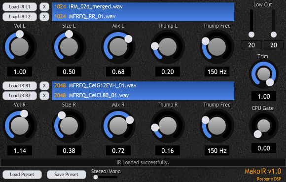

# Mako IR VST
* JUCE VST3 Guitar Speaker Sim.
* Tested on Windows only.
* Written in Visual C++ 2022.
* Written for new programmers, not complicated.
* Version: 1.00
* Posted: June 5, 2024

VERSION
------------------------------------------------------------------
1.00 - Initial release.

DISCLAIMER
------------------------------------------------------------------  
This VST was written in a very simple way. No object defs, etc. 
Just simple code for people who are not programmers but want to 
dabble in the magic of JUCE VSTs.

If you are new to JUCE code, the Mako Thump VST may be a better
starting place. Or be brave and try this.
       
SUMMARY
------------------------------------------------------------------
A Juce/C++ VST3 written to simulate a speaker cabinet. This VST uses its own routines to deal 
with IRs. Juce has some built in IR functions because it is awesome, but thats no fun. And it 
does not help anyone learn about IRs. Better to write your own and learn when possible.

# THEORY OF OPERATION 
This VST is designed to simulate a speaker cabinet. It uses standard Impulse Response (IR) files.
This VST can be useful to fine tune things like other Guitar Amplifier VSTs.

The IR files this VST works with are:
- A wave file that has a pulse 1024 or 2048 samples in length.
- Created at the sample your will be using the VST at. 
- Mono files.

An IR is a pulse that defines the frequency reponse of a system (speaker). They can be created by
sending a single sample pulse thru a system or by doing a frequency sweep of a system. Once tests
are completed you will have a soft rising pulse that rings (oscillates).

The IR pulse represents the frequency response of the speaker. Think of each sample in the IR as a volume for a delay.
So a 1024 sample IR is really just the volumes for 1024 delay pedals all set to different times. Every delay creates a
comb filter. Basically a dip in the frequency resonse. When you add all of these echoes together, the comb filter effects
and volumes will create the frequency response of the speaker.

Taken to the next logical step, there are IRs that are used as reverbs. These IRs will be very very very large of course.
Our 1024 sample IR @ 48 kHz is basically a reverb pedal with only 23 mS worth of data. And the 1024 IR is heavy on CPU usage.
Now imagine a 10 or 20 second reverb IR. No processor can do that much math as fast as needed. So tricks need to be employed
to mimic the actual IR, like only using part of the IR and then applying an EQ to simulate the rest of the IR. But you now 
have the tools to make an IR Reverb that uses millions of samples if you want. It will only work during mixdown of course.

SAMPLE RATE  
IRs are normally saved as WAVE files at a standard sample rate, such as 44.1 kHz. But they can be created
at any frequency. If you are using the IR in this VST, you will want the IR sample rate to match the rate your
DAW is running in. Normally, a VST would identify the sample rate and resample the file data to match the
DAW sample rate. This VST does not do that because you have control of the resampling process under the
SIZE adjustment.

FILE SIZE  
The files should be very close 1024 or 2048 samples in length. Sometimes the IR creator will provide a much
larger file. This VST is not designed to handle non-standard sizes. This VST does not provide code to search
thru a giant WAVE file looking for the actual IR pulse. I would suggest using and audio editor such as Goldwave
to edit the IR files before use, or you can add code yourself in the VST!

MIXING  
This VST allows you to load two IRs for each channel of audio (Left, Right). The IRs can be mixed in the VST.
For best results the IR pulses in the files should be aligned in time. It is not necessary, but may provide 
a better mix. This VST does not try to align the pulses. Again, that operation should be done in an audio editor before use.  

STRINGS IN A VST  
When the VST standard was created, strings were not added. A DAWs access is mainly for changing parameters. 
There are no use cases where the DAW would ever adjust a string. This creates a problem for dealing with IRs.
Because IRs are files. Files have file paths that need to be sotred. We cant save paths natively in the VST/DAW interface.

To get around this issue, this program has its own PRESET storage code. And it has code that loads/saves the last used IRs.
The last used IRs are loaded when the program starts.

There are methods that will allow the paths to be saved in the normal JUCE XML parameters. But they are not used in this app.

# FEATURES  
IR MIXER  
As mentioned above, you can mix two IRs to give you control over the IR sound.  

STEREO OPERATION  
Each audio channel can use a seperate IR. Having a stereo field helps the sound feel larger and more lively. 

SPEAKER SIZE  
Each IR channel can be resampled (rescaled) to sound like a larger or smaller speaker.

THUMP 
Every Mako VST has a feature called Thump. It is a low pass filtered signal that gets amplified to simulate a
speaker cabinets resonance and compression. 

LOW CUT  
When using Thump, the very low frequencies of the signal are amplified. Use the lo cut to remove the frequencies that
are making the sound muddy, woofy, etc.

TRIM AND CPU GATE - GIMMICKS  
The calculations for an IR are very expensive for CPU usage. Every single sample of your audio needs to be multiplied by the IR.
That means thousands of multiplies for every sample of data you send thru the VST. When running in stereo, you are doing all these
calcs twice.

For that reason, it is best to normally use 1024 sample IRs in Mono. That uses the least amount of CPU. The smaller the IR sample size,
the worse the low frequency response is. 1024 = fastest and 2048 = best quality.

Since 90% of the sound created by an IR is only in the first 10% of the IR file, we have added a TRIM slider that lets you adjust how many
samples you want to use. It adjusts from 0% size to 100% size. This reduces the CPU load. Dial it down until the sounds gets bad. When
you go to do your final DAW render, set the TRIM back to full size to get the better audio quality.

90% of the time a VST is in use, it is probably sitting idle. The CPU gate is a typical noise gate that bypasses the IR calculations
if no signal is detected. When doing final renders, turn this feature off to guarentee better audio quality. It will introduce weird
sounds when notes slowly die out. 

Both TRIM and GATE are tools to help reduce CPU usage while tweaking. Do not use for final rendering of audio. 

 

